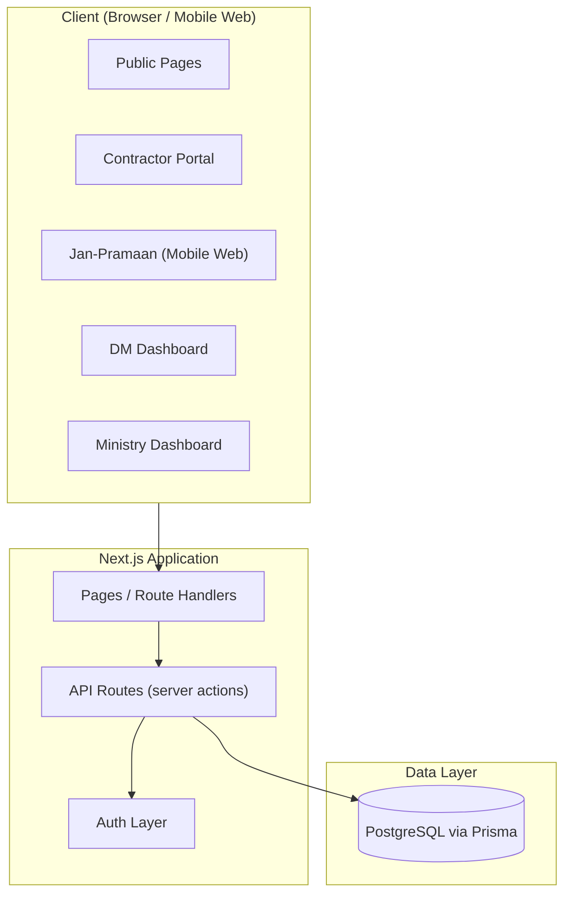
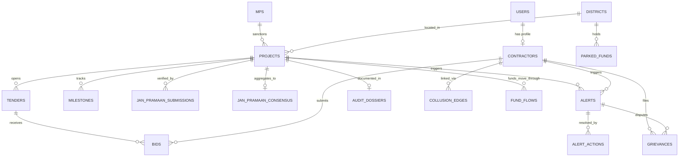

# Technical Requirements Document (TRD)
## MPLADS AI Watchdog — Prototype

**Status:** Draft v1
**Companion documents:** `prd.md` (product scope/features), `data.md` (real reference data supplied by the user; fake data fills any gaps per the PRD's data approach)
**Scope note:** This TRD covers architecture, technology choices, and database schema for the prototype described in the PRD. It does not re-derive product requirements — see `prd.md` for what each page/module must do.

---

## 1. Architecture Overview

The prototype is built as a single full-stack web application — one deployable unit serving all five audiences (public visitor, citizen verifier, contractor, DM, ministry) as different route groups/roles of the same app, backed by one relational database.

This is intentionally a **monolith**, not a microservices setup — appropriate for a prototype with a small, fixed feature set and no real-time/high-scale requirements yet.



Photos (Jan-Pramaan submissions, contractor-vs-citizen comparisons) are not backed by a separate object-storage service. Since the prototype has no real photo records, "photos" are handled one of two ways, both avoiding any storage infrastructure:
- **Seeded/demo photos:** bundled as static assets inside the app (e.g. `/public/images/jan-pramaan/...`) and referenced by a static path — these are the ones that will actually render correctly during a demo.
- **Live-captured photos** (if the camera-capture flow itself is demoed, e.g. via the mobile-web capture step): stored inline as a base64 data URI directly in the database column, rather than uploaded to a bucket. This is fine at prototype scale (a handful of demo submissions) and removes a moving part.

If a future real build needs actual photo volume, this is the one piece explicitly designed to be swapped later for a real object store (S3/Supabase Storage/Cloudinary) without changing anything else in the schema — the column just starts holding real URLs instead of static paths or base64 data.

---

## 2. Technology Stack

| Layer | Choice | Why |
|---|---|---|
| Frontend framework | **Next.js 14 (App Router) + TypeScript** | One framework covers public pages, authenticated dashboards, and lightweight API routes — no separate frontend/backend deployment needed for a prototype |
| Styling | **Tailwind CSS** | Fast to build consistent, card-based layouts across five different dashboards without hand-writing CSS per page |
| Data fetching / caching | **TanStack Query (React Query)** | Handles loading/error states and caching for dashboard data without extra boilerplate |
| ORM & migrations | **Prisma** | Type-safe schema-first modeling, generates migrations directly from the schema in §5 |
| Database | **PostgreSQL** (hosted on Supabase or Neon for the prototype) | Relational structure fits the project/contractor/alert/fund relationships well; Supabase/Neon give a free managed instance suitable for a prototype |
| Auth | **NextAuth.js**, Credentials provider (email/phone + password or OTP), JWT session | Matches the PRD's "email/phone + password or OTP" requirement without needing a real identity provider |
| File/photo storage | **Supabase Storage** (or any S3-compatible bucket) | Stores Jan-Pramaan and contractor-submitted photos referenced by URL in the DB |
| Maps — India choropleth | **react-simple-maps + topojson** (India states topology) | Purpose-built for shading a country map by a metric (risk/utilization) and handling click drill-downs, without needing a paid maps API key |
| Maps — project location & satellite imagery | **OpenLayers**, with an XYZ satellite tile source (e.g. Esri World Imagery — free, no API key) plus a standard street basemap toggle | Handles both the everyday project-location pin (individual project page) and the DM's satellite overlay (sanctioned pin vs. citizen photo GPS pins) with one library, rather than mixing two map stacks for slightly different jobs. OpenLayers natively supports layer-switching between a street basemap and a satellite imagery layer, which the satellite-overlay comparison view needs |
| Charts (line/bar/donut/progress) | **Recharts** | Covers KPI trend lines, bar rankings, and donut breakdowns with minimal setup |
| Sankey diagram (Fund Tracker) | **@nivo/sankey** | Purpose-built Sankey component; avoids hand-rolling D3 Sankey layout math |
| Collusion graph | **Custom lightweight SVG component** (not a full graph library) | The prototype only ever renders one fixed 3-node/2-edge scenario — a general graph library (e.g., Cytoscape.js, react-force-graph) would be overkill; noted as a future swap-in if a real, larger graph is built |
| QR generation | **qrcode.react** | Generates the per-project QR code once a project is marked complete |
| QR scanning | **html5-qrcode** | Works in mobile browsers without a native app, for the Jan-Pramaan mobile-web scan step |
| Camera capture (mobile web) | Native `<input type="file" accept="image/*" capture="environment">` | Browser-level camera-only capture (no gallery picker), matching the anti-spoofing intent without extra libraries |
| Geolocation / geofencing | Browser Geolocation API (`navigator.geolocation`) | Used client-side to gate the "Verify This Project" button to within 50m of the site; server re-validates the coordinate on submission |
| Photo handling | Static bundled assets for seeded demo photos; inline base64 storage in Postgres for any live-captured demo photo (see §1) | No cloud object-storage service needed for a handful of demo images |
| Hosting | **Vercel** (app) + **Supabase/Neon** (database only) | Zero-ops deployment suited to a prototype/demo timeline |

### 2.1 Notes on scope
- No AI/ML runtime is included anywhere in this stack — all alerts, scores, and flags are static rows seeded into the database (see §5 and §6), matching the PRD's explicit non-goal.
- No push notification service, offline sync engine, or native mobile build is included — these map to standalone-app features the PRD marks as "documented, not built."
- No payment gateway or escrow integration is included — "Smart Escrow" remains a status field on `milestones`, not a functioning payment flow.

---

## 3. Application Structure

Route groups map directly to the five audiences from the PRD, sharing one codebase and one set of API routes:

```
/                      → Public: tender/project listing
/projects/[id]         → Public: individual project page + timeline
/contractors/[id]      → Public: contractor profile
/jan-pramaan/[id]      → Public + mobile web: status banner, consensus meter, verify action
/contractor/*          → Authenticated contractor portal (signup, bids, projects, trust score, grievances)
/dm/*                  → Authenticated DM dashboard (overview, alerts, projects, contractors, audit log, fund tracker)
/ministry               → Authenticated ministry/national overview
/dm/audit/collusion/[id] → DM-only collusion graph view
```

Authentication middleware protects `/contractor/*`, `/dm/*`, and `/ministry` by role; all other routes are public and unauthenticated.

---

## 4. Data Provenance Handling

Per the PRD's data approach (real data where supplied, fake data filling any gap), every major table that can hold either kind of record carries an `is_real_data` boolean. This lets the same queries/pages render a mix of real and fake rows without the frontend needing to know which is which — provenance is a data concern, not a display concern. Seed scripts read `data.md` for real records first, and generate the remaining fake records to match expected counts/structure (e.g., filling out audit dossiers to the stated total, or populating sample alerts).

---

## 5. Database Schema

All tables use a UUID primary key (`id`) and `created_at`/`updated_at` timestamps unless noted otherwise.

### 5.1 Identity & Roles

**`users`**
| Column | Type | Notes |
|---|---|---|
| id | uuid, PK | |
| name | text | |
| email | text, unique, nullable | |
| phone | text, unique, nullable | |
| password_hash | text, nullable | null if OTP-only account |
| role | enum(`citizen`,`contractor`,`dm`,`ministry`,`admin`) | |
| district_id | uuid, FK → districts.id, nullable | populated for `dm` role |
| created_at | timestamp | |

### 5.2 Reference Data

**`mps`**
| Column | Type | Notes |
|---|---|---|
| id | uuid, PK | |
| name | text | |
| constituency | text | |
| state | text | |
| is_real_data | boolean | |

**`districts`**
| Column | Type | Notes |
|---|---|---|
| id | uuid, PK | |
| name | text | |
| state | text | |

### 5.3 Contractors

**`contractors`**
| Column | Type | Notes |
|---|---|---|
| id | uuid, PK | |
| user_id | uuid, FK → users.id | |
| company_name | text | |
| registration_number | text | |
| gst_number | text, nullable | |
| pan_number | text, nullable | |
| phone | text | used for the collusion-graph "shared phone number" check |
| registered_address | text, nullable | used for the collusion-graph "shared address" check |
| kyc_status | enum(`unverified`,`verified`) | |
| trust_score | numeric, nullable | 0–100 internally; shown publicly as a star rating |
| is_real_data | boolean | |

### 5.4 Projects, Tenders & Bids

**`projects`**
| Column | Type | Notes |
|---|---|---|
| id | uuid, PK | |
| title | text | |
| description | text, nullable | |
| category | enum(`road`,`school`,`solar_plant`,`community_hall`,`drainage`,`other`) | |
| mp_id | uuid, FK → mps.id | |
| district_id | uuid, FK → districts.id | |
| sanctioned_amount | numeric | |
| billed_amount | numeric, default 0 | |
| sanction_date | date | |
| latitude | numeric, nullable | |
| longitude | numeric, nullable | |
| status | enum(`sanctioned`,`tendered`,`awarded`,`in_progress`,`completed`,`citizen_verified`,`payment_released`) | single source of truth shown across public/contractor/DM/ministry views |
| assigned_contractor_id | uuid, FK → contractors.id, nullable | set once awarded |
| is_real_data | boolean | |

**`tenders`**
| Column | Type | Notes |
|---|---|---|
| id | uuid, PK | |
| project_id | uuid, FK → projects.id | |
| bid_deadline | date | |
| status | enum(`open`,`closed`,`awarded`) | |

**`bids`**
| Column | Type | Notes |
|---|---|---|
| id | uuid, PK | |
| tender_id | uuid, FK → tenders.id | |
| contractor_id | uuid, FK → contractors.id | |
| price_quote | numeric | |
| proposed_timeline_days | integer | |
| supporting_docs_url | text, nullable | static asset path or placeholder text for the prototype — no upload/storage service required |
| status | enum(`submitted`,`under_review`,`won`,`lost`) | |
| submitted_at | timestamp | |

**`milestones`**
| Column | Type | Notes |
|---|---|---|
| id | uuid, PK | |
| project_id | uuid, FK → projects.id | |
| name | enum(`sanctioned`,`started`,`in_process`,`completed`,`citizen_verified`,`paid`) | |
| sequence_order | integer | |
| payment_status | enum(`pending`,`released`,`frozen`) | conceptually tied to "Smart Escrow"; not a real payment integration |
| reached_at | timestamp, nullable | |

### 5.5 Jan-Pramaan

**`jan_pramaan_submissions`**
| Column | Type | Notes |
|---|---|---|
| id | uuid, PK | |
| project_id | uuid, FK → projects.id | |
| citizen_id | uuid, FK → users.id, nullable | anonymized in any DM-facing display |
| photo_url | text | holds either a static asset path (seeded demo photo) or a base64 data URI (a live-captured demo submission) — no external storage service; see §1 |
| device_timestamp | timestamp | |
| server_timestamp | timestamp | source of truth per PRD §4.3.5 |
| gps_lat | numeric | |
| gps_lng | numeric | |
| gps_deviation_m | numeric, nullable | distance from sanctioned project pin |
| mock_location_flag | boolean, default false | |
| photo_hash | text, nullable | pHash-style duplicate-check value |
| vote | enum(`up`,`down`) | |
| note | text, nullable | |
| is_real_data | boolean | |

**`jan_pramaan_consensus`** *(derived/materialized per project — can be a DB view instead of a table)*
| Column | Type | Notes |
|---|---|---|
| project_id | uuid, PK, FK → projects.id | |
| submission_count | integer | |
| thumbs_up_count | integer | |
| thumbs_down_count | integer | |
| status | enum(`awaiting`,`verified`,`disputed`) | |
| updated_at | timestamp | |

### 5.6 Alerts & Audit

**`alerts`**
| Column | Type | Notes |
|---|---|---|
| id | uuid, PK | |
| category | enum(`financial_procurement`,`image_forensics`,`jan_pramaan`,`fund_timeline`) | maps to Alerts Inbox tabs |
| type | text | e.g. `cost_anomaly`, `duplicate_project`, `split_tender`, `cartel_collusion`, `gps_mismatch`, `duplicate_image`, `timestamp_anomaly`, `negative_consensus`, `mock_location`, `parked_funds`, `stalled_project` |
| project_id | uuid, FK → projects.id, nullable | |
| contractor_id | uuid, FK → contractors.id, nullable | |
| risk_score | integer | 0–100 |
| description | text | human-readable alert text, e.g. "Invoice 300% above district baseline" |
| status | enum(`open`,`approved`,`rejected`,`audit_triggered`,`reminder_sent`,`escalated`) | |
| created_at | timestamp | |

**`alert_actions`**
| Column | Type | Notes |
|---|---|---|
| id | uuid, PK | |
| alert_id | uuid, FK → alerts.id | |
| dm_id | uuid, FK → users.id | |
| decision | enum(`approved_with_justification`,`audit_initiated`,`rejected`,`physical_audit_requested`,`reminder_sent`,`escalated`) | |
| justification_note | text | required by PRD |
| created_at | timestamp | |

**`audit_dossiers`**
| Column | Type | Notes |
|---|---|---|
| id | uuid, PK | |
| case_id | text, unique | e.g. `WRK-2024-01` |
| project_id | uuid, FK → projects.id | |
| category | text | mirrors project category for filtering |
| risk_score | integer | 0–100 |
| billed_amount | numeric | |
| sanctioned_amount | numeric | |
| alert_tag | text, nullable | e.g. "Overpricing Alert" |
| is_real_data | boolean | |

### 5.7 Collusion Graph (static scenario)

**`collusion_edges`**
| Column | Type | Notes |
|---|---|---|
| id | uuid, PK | |
| contractor_a_id | uuid, FK → contractors.id | |
| contractor_b_id | uuid, FK → contractors.id | |
| shared_attribute | enum(`phone_number`,`pan_prefix`,`registered_address`) | |
| project_id | uuid, FK → projects.id | the real project this scenario is anchored to |

### 5.8 Funds

**`fund_flows`**
| Column | Type | Notes |
|---|---|---|
| id | uuid, PK | |
| project_id | uuid, FK → projects.id, nullable | |
| from_entity | enum(`ministry`,`state`,`district`) | |
| to_entity | enum(`state`,`district`,`contractor`) | |
| amount | numeric | |
| flow_date | date | |
| is_real_data | boolean | feeds the Fund Tracker Sankey diagram |

**`parked_funds`**
| Column | Type | Notes |
|---|---|---|
| id | uuid, PK | |
| district_id | uuid, FK → districts.id | |
| amount | numeric | |
| parked_since | date | |
| reason | text, nullable | |
| is_real_data | boolean | |

### 5.9 Grievances

**`grievances`**
| Column | Type | Notes |
|---|---|---|
| id | uuid, PK | |
| contractor_id | uuid, FK → contractors.id | |
| alert_id | uuid, FK → alerts.id, nullable | |
| description | text | |
| evidence_url | text, nullable | |
| status | enum(`open`,`resolved`,`rejected`) | |
| resolved_by_dm_id | uuid, FK → users.id, nullable | |
| created_at | timestamp | |

### 5.10 Entity Relationship Summary



---

## 6. Seeding Strategy

- A seed script reads real records from `data.md` first and inserts them with `is_real_data = true`.
- For any table/module where the PRD calls for a fixed sample count (e.g., the 3-contractor collusion scenario, 2–3 KYC examples, a full set of audit dossiers), the seed script generates the remaining fake records needed to reach that count, marked `is_real_data = false`.
- Seeding is idempotent (safe to re-run) so the prototype can be reset to a known demo state at any time.

---

## 7. Non-Functional Requirements

- **Responsiveness:** the Jan-Pramaan verification flow and general public pages must work correctly on mobile-web viewport sizes, since citizen verification happens on-site via phone browser.
- **Auth boundaries:** route-level middleware must prevent a contractor session from reaching `/dm/*` or `/ministry`, and vice versa, regardless of direct URL access.
- **Data integrity:** a project's `status` field is the single source of truth read by every view (public tracker, contractor milestones, DM project view, ministry funnel) — no view maintains its own copy of project stage.
- **Environment:** single deployment environment is sufficient for the prototype (no separate staging/production split required at this stage).

---

## 8. Explicitly Out of Scope (Technical)

- Any real ML/AI inference service (no model hosting, no vector search, no graph-algorithm service).
- Real Aadhaar eKYC or PAN+GST verification API integrations.
- Push notification infrastructure or offline sync/queueing (relevant only to the standalone citizen app, not built).
- Payment gateway or escrow integration.
- A general-purpose graph database or graph-algorithm engine (e.g., Neo4j) — the collusion graph is a fixed, hardcoded scenario, not a live query.
- A cloud object-storage service (S3, Supabase Storage, Cloudinary, etc.) — demo photos are handled via bundled static assets or inline database storage instead (see §1).
